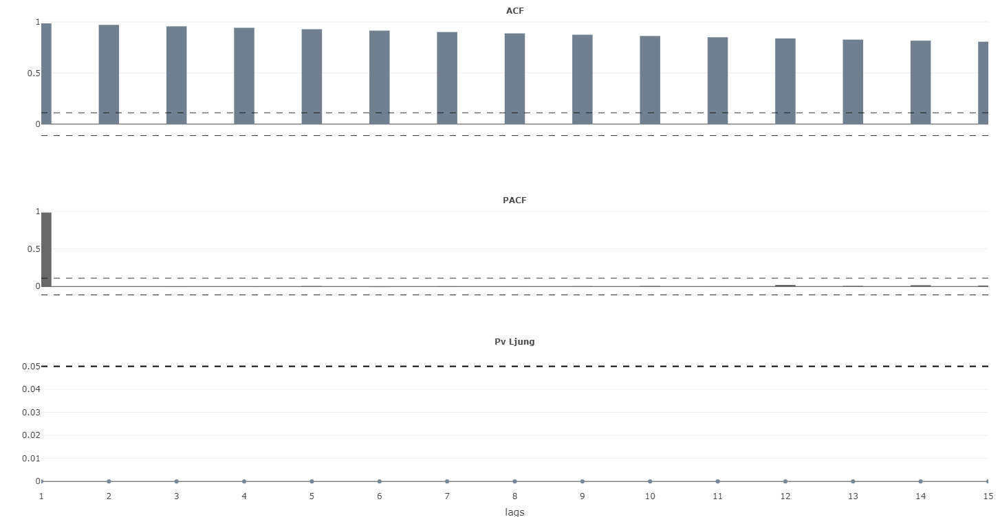
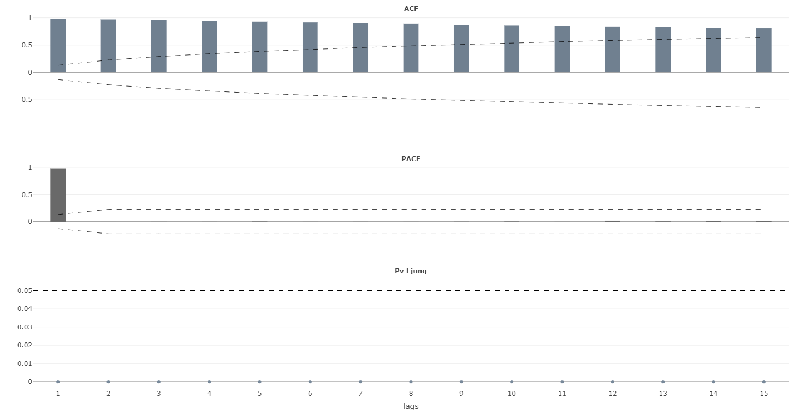
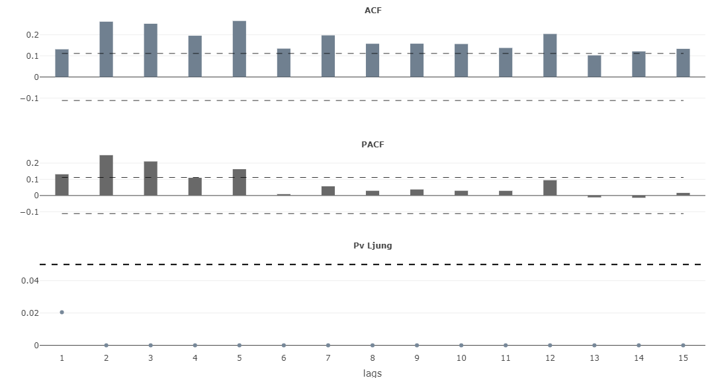

<!-- README.md is generated from README.Rmd. Please edit that file -->

# actfts: Tools for Analysis of Time Series

<!-- badges: start -->

[](https://lifecycle.r-lib.org/articles/stages.html#experimental)
<!-- badges: end -->

The **actfts package** offers a flexible approach to time series
analysis, allowing users to focus on calculating Autocorrelation (ACF)
and Partial Autocorrelation (PACF) functions and stationarity tests. It
generates interactive plots to visualize these results, providing a
dynamic data view. The process begins by validating and transforming the
input data series based on the specified difference type (levels,
first-order, second-order, or third-order differences). It then
calculates the ACF and PACF functions up to a specified number of lags
and conducts Box-Pierce and Ljung-Box tests to evaluate the independence
of observations at different lags.

Additionally, the function performs stationarity tests, including ADF,
KPSS (level and trend), and PP tests, organizing the results into
tables. It also performs Box and Cox variance stabilization tests. It
generates interactive plots for the ACF, PACF, and Ljung-Box p-values,
displaying confidence lines calculated according to the specified
method. The function saves the results to a TIFF file and an Excel
spreadsheet if the download option is enabled. In interactive mode, the
function displays tables with the ACF-PACF and stationarity test
results.

## Installation

You can install the development version of actfts from:

``` r
install.packages("actfts")
devtools::install_github("SergioFinances/actfts")
```

## Example

This is a basic example which shows you how to use this actfts:

``` r
library(actfts)
options(scipen = 999)
data <- actfts::GDPEEUU
```

- **Example 1** It shows the ACF, PAC, and Pv Ljung plots and a list of
  two elements, the ACF-PACF Test and the Stationary test, with the
  default arguments.

``` r
result <- actfts::acfinter(data, lag = 15)
print(result)
#> $`ACF-PACF Test`
#>    lag       acf          pacf Box_Pierce Pv_Box Ljung_Box Pv_Ljung
#> 1    1 0.9853471  0.9853470819   300.9818      0  303.9039        0
#> 2    2 0.9709040 -0.0001677573   593.2047      0  599.9219        0
#> 3    3 0.9565352 -0.0047242367   876.8421      0  888.1789        0
#> 4    4 0.9422924 -0.0029745719  1152.0958      0 1168.8297        0
#> 5    5 0.9284525  0.0065815855  1419.3232      0 1442.1902        0
#> 6    6 0.9146149 -0.0068823059  1678.6445      0 1708.3357        0
#> 7    7 0.9010486  0.0021906137  1930.3300      0 1967.4970        0
#> 8    8 0.8877256  0.0014678003  2174.6276      0 2219.8839        0
#> 9    9 0.8747132  0.0039691400  2411.8158      0 2465.7401        0
#> 10  10 0.8620923  0.0067800862  2642.2087      0 2705.3488        0
#> 11  11 0.8496976  0.0015469450  2866.0243      0 2938.8955        0
#> 12  12 0.8380870  0.0207369256  3083.7652      0 3166.8658        0
#> 13  13 0.8268790  0.0083976165  3295.7211      0 3389.5266        0
#> 14  14 0.8163257  0.0172549567  3502.3013      0 3607.2733        0
#> 15  15 0.8062809  0.0127308937  3703.8289      0 3820.4143        0
#> 
#> $`Stationary Test`
#>            Statistic P_Value
#> ADF         2.586751    0.99
#> KPSS-Level  4.708600    0.01
#> KPSS-Trend  1.215522    0.01
#> PP          3.431542    0.99
#> 
#> $`Normality Test`
#>                    Statistic P_Value
#> Shapiro Wilks        0.84705       0
#> Kolmogorov Smirnov   0.17555       0
#> Box Cox              0.15000      NA
#> Box Cox Guerrero    -0.00578      NA
```



- **Example 2** Shows the ACF, PAC, and Pv Ljung plots and a list with
  two elements, ACF-PACF Test and Stationary test with 25 lags, method
  of moviles average to calculate the confidence interval and
  confidential interval equals to 98%.

``` r
result <- actfts::acfinter(data, lag = 15, ci.method = "ma", ci = 0.98)
print(result)
#> $`ACF-PACF Test`
#>    lag       acf          pacf Box_Pierce Pv_Box Ljung_Box Pv_Ljung
#> 1    1 0.9853471  0.9853470819   300.9818      0  303.9039        0
#> 2    2 0.9709040 -0.0001677573   593.2047      0  599.9219        0
#> 3    3 0.9565352 -0.0047242367   876.8421      0  888.1789        0
#> 4    4 0.9422924 -0.0029745719  1152.0958      0 1168.8297        0
#> 5    5 0.9284525  0.0065815855  1419.3232      0 1442.1902        0
#> 6    6 0.9146149 -0.0068823059  1678.6445      0 1708.3357        0
#> 7    7 0.9010486  0.0021906137  1930.3300      0 1967.4970        0
#> 8    8 0.8877256  0.0014678003  2174.6276      0 2219.8839        0
#> 9    9 0.8747132  0.0039691400  2411.8158      0 2465.7401        0
#> 10  10 0.8620923  0.0067800862  2642.2087      0 2705.3488        0
#> 11  11 0.8496976  0.0015469450  2866.0243      0 2938.8955        0
#> 12  12 0.8380870  0.0207369256  3083.7652      0 3166.8658        0
#> 13  13 0.8268790  0.0083976165  3295.7211      0 3389.5266        0
#> 14  14 0.8163257  0.0172549567  3502.3013      0 3607.2733        0
#> 15  15 0.8062809  0.0127308937  3703.8289      0 3820.4143        0
#> 
#> $`Stationary Test`
#>            Statistic P_Value
#> ADF         2.586751    0.99
#> KPSS-Level  4.708600    0.01
#> KPSS-Trend  1.215522    0.01
#> PP          3.431542    0.99
#> 
#> $`Normality Test`
#>                    Statistic P_Value
#> Shapiro Wilks        0.84705       0
#> Kolmogorov Smirnov   0.17555       0
#> Box Cox              0.15000      NA
#> Box Cox Guerrero    -0.00578      NA
```



- **Example 3** The time series transformation’s first difference shows
  the ACF, PAC, and Pv Ljung plots and a list with two elements: the
  ACF-PACF Test and the Stationary Test.

``` r
result <- actfts::acfinter(data, lag = 15, delta = "diff1")
print(result)
#> $`ACF-PACF Test`
#>    lag       acf         pacf Box_Pierce                   Pv_Box  Ljung_Box
#> 1    1 0.1312146  0.131214621   5.320139 0.0210803357615012565418   5.371958
#> 2    2 0.2621484  0.249222071  26.555173 0.0000017124480148345000  26.883671
#> 3    3 0.2523588  0.210289294  46.233823 0.0000000005058001795177  46.883867
#> 4    4 0.1955710  0.109469830  58.052459 0.0000000000074399375549  58.935000
#> 5    5 0.2656124  0.162653332  79.852400 0.0000000000000008881784  81.236914
#> 6    6 0.1344658  0.008612336  85.439441 0.0000000000000002220446  86.971468
#> 7    7 0.1972724  0.057082491  97.464612 0.0000000000000000000000  99.355004
#> 8    8 0.1575084  0.029384349 105.130559 0.0000000000000000000000 107.275635
#> 9    9 0.1578995  0.037367489 112.834624 0.0000000000000000000000 115.262182
#> 10  10 0.1563879  0.029506147 120.391895 0.0000000000000000000000 123.122754
#> 11  11 0.1376692  0.029070032 126.248310 0.0000000000000000000000 129.234651
#> 12  12 0.2039234  0.094583732 139.097999 0.0000000000000000000000 142.690049
#> 13  13 0.1025867 -0.011282673 142.349926 0.0000000000000000000000 146.106770
#> 14  14 0.1213209 -0.013721330 146.898023 0.0000000000000000000000 150.901543
#> 15  15 0.1334143  0.016219846 152.398034 0.0000000000000000000000 156.719582
#>                    Pv_Ljung
#> 1  0.0204629943080092413510
#> 2  0.0000014530650896960040
#> 3  0.0000000003679027082981
#> 4  0.0000000000048557824428
#> 5  0.0000000000000004440892
#> 6  0.0000000000000001110223
#> 7  0.0000000000000000000000
#> 8  0.0000000000000000000000
#> 9  0.0000000000000000000000
#> 10 0.0000000000000000000000
#> 11 0.0000000000000000000000
#> 12 0.0000000000000000000000
#> 13 0.0000000000000000000000
#> 14 0.0000000000000000000000
#> 15 0.0000000000000000000000
#> 
#> $`Stationary Test`
#>               Statistic    P_Value
#> ADF          -5.4641315 0.01000000
#> KPSS-Level    2.7616640 0.01000000
#> KPSS-Trend    0.1998598 0.01605257
#> PP         -375.4592842 0.01000000
#> 
#> $`Normality Test`
#>                    Statistic P_Value
#> Shapiro Wilks        0.54931       0
#> Kolmogorov Smirnov   0.27583       0
```



- **Example 4** When we use the interactive argument with a value equal
  to “stattable”, the function interactively shows the ACF-PACF Test,
  the Stationary Test, and the plot. Additionally, with the argument
  download equals true, the function saves the results in an xlsx
  format.

## References

- U.S. Bureau of Economic Analysis, Personal Consumption Expenditures
  (PCEC), retrieved from FRED, Federal Reserve Bank of St. Louis;
  <https://fred.stlouisfed.org/series/PCEC>.
- U.S. Bureau of Economic Analysis, Gross Domestic Product (GDP),
  retrieved from FRED, Federal Reserve Bank of St. Louis;
  <https://fred.stlouisfed.org/series/GDP>.
- U.S. Bureau of Economic Analysis, Disposable Personal Income (DPI),
  retrieved from FRED, Federal Reserve Bank of St. Louis;
  <https://fred.stlouisfed.org/series/DPI>.
